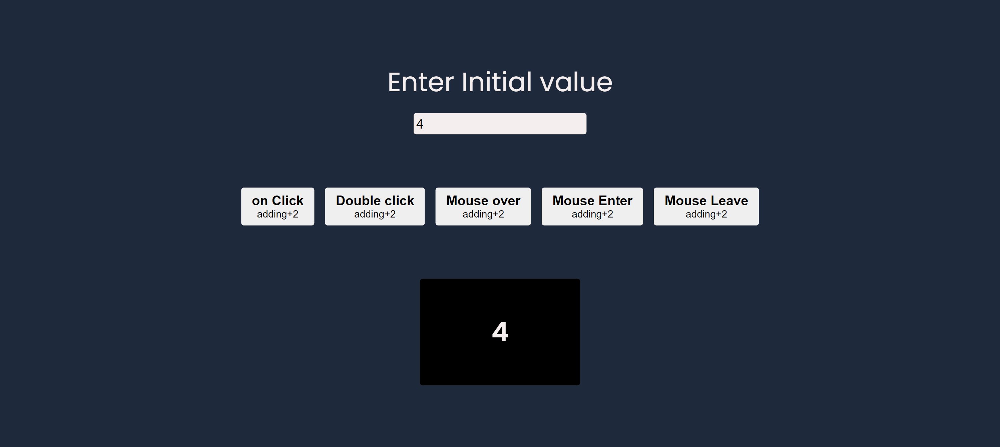

# MouseEvent

## Introduction

**MouseEvent** is a basic webpage which highlights each mouse events when interacted with a button and output is displayed

## Technologies Used

- vanilla js: JavaScript library for building user interfaces
- CSS: For basic styling

## Screenshot

### Desktop version



## Getting Started

To get started with the MouseEvent, follow these steps:

1. Clone the repository:

   ```bash
   git clone https://github.com/Avinash-Tallapaneni/Training_files/tree/main/project1-mouseEvents
   ```

2. Lauch using live server **MouseEvent**.

# Folder Structure

Folder structure will be included as the project grows

# Contributing

Contributions to the Mouse Events are welcome! If you find any bugs or have suggestions for improvements, please create an issue or submit a pull request.

## Author

My name is Avinash Tallapaneni, and I am a front-end web developer passionate about creating immersive and engaging user experiences. MouseEvents is a project that showcases my skills and dedication to building high-quality web applications.

- GitHub - [Your GitHub Profile](https://github.com/avinash-tallapaneni)
- Twitter - [Twitter Profile](https://twitter.com/TallapaneniAvi)

## Feedback

I appreciate any feedback you have on MouseEvents. If you have any suggestions, bug reports, or general feedback, please feel free to

# License

This project is licensed under the MIT License.
Feel free to modify the content to match your project and provide additional information as needed.
